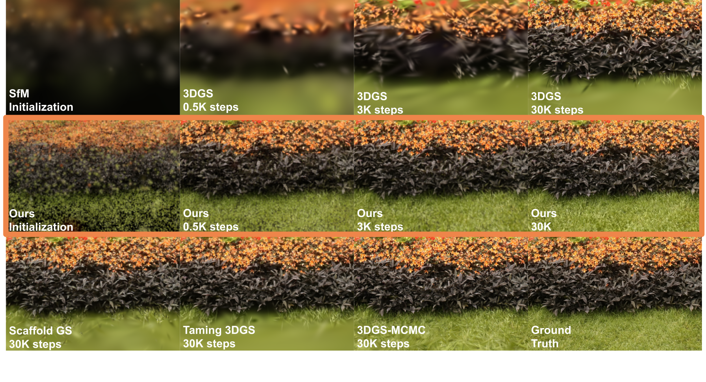
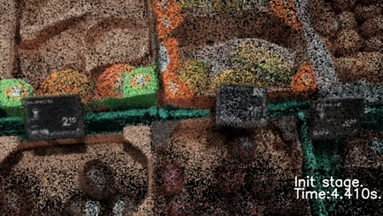

<h1 align="center">EDGS: Eliminating Densification for Efficient Convergence of 3DGS (CVPR 2026) </h2>

<p align="center">
  <a href="https://www.linkedin.com/in/dmitry-kotovenko-dl/">Dmytro Kotovenko</a><sup>*</sup> ·
  <a href="https://www.linkedin.com/in/grebenkovao/">Olga Grebenkova</a><sup>*</sup> ·
  <a href="https://ommer-lab.com/people/ommer/">Björn Ommer</a>
</p>

<p align="center">CompVis @ LMU Munich · Munich Center for Machine Learning (MCML) </p>
<p align="center">* equal contribution </p>

<p align="center">
  <a href="https://compvis.github.io/EDGS/"></a>
  <a href="https://arxiv.org/pdf/2504.13204"></a>
  <a href="https://colab.research.google.com/github/CompVis/EDGS/blob/main/notebooks/fit_model_to_scene_full.ipynb"></a>
  <a href="https://huggingface.co/spaces/CompVis/EDGS"></a>
  
</p>

<p align="center">
  
</p>

<p>
<strong>3DGS</strong> initializes with a sparse set of Gaussians and progressively adds more in under-reconstructed regions. In contrast, <strong>EDGS</strong> starts with
a dense initialization from triangulated 2D correspondences across training image pairs, 
requiring only minimal refinement. This leads to <strong>faster convergence</strong> and <strong>higher rendering quality</strong>. Our method reaches the original 3DGS <strong>LPIPS score in just 25% of the training time</strong> and uses only <strong>60% of the splats</strong>. 
Renderings become <strong>nearly indistinguishable from ground truth after only 3,000 steps — without any densification</strong>.
</p>

<h3 align="center">3D scene reconstruction using our method in 11 seconds.</h3>
<p align="center">
  
</p>

## 📢 News
2026-03-25: Updated training code will be released soon.<br>
2026-03-02: The paper has been accepted to CVPR 2026.<br>

## 📚 Table of Contents
- [🚀 Quickstart](#sec-quickstart)
- [🛠️ Installation](#sec-install)
- [📦 Data](#sec-data)

- [🏋️ Training](#sec-training)
- [📊 Rendering and evaluation](#sec-evaluation)
- [🏗️ Reusing Our Model](#sec-reuse)
- [📄 Citation](#sec-citation)

<a id="sec-quickstart"></a>
## 🚀 Quickstart
The fastest way to try our model is through the [Hugging Face demo](https://huggingface.co/spaces/magistrkoljan/EDGS), which lets you upload images or a video and interactively rotate the resulting 3D scene. For broad accessibility, we currently support only **forward-facing scenes**.
#### Steps:
1. Upload a list of photos or a single video.
2. Click **📸 Preprocess Input** to estimate 3D positions using COLMAP.
3. Click **🚀 Start Reconstruction** to run the model.

You can also **explore the reconstructed scene in 3D** directly in the browser.

> ⚡ Runtime: EDGS typically takes just **10–20 seconds**, plus **5–10 seconds** for COLMAP processing. Additional time may be needed to save outputs (model, video, 3D preview).

You can also run the same app locally on your machine with command: 
```CUDA_VISIBLE_DEVICES=0 python gradio_demo.py --port 7862 --no_share```
Without `--no_share` flag you will get the adress for gradio app that you can share with the others allowing others to process their data on your server. 

Alternatively, check our [Colab notebook](https://colab.research.google.com/github/CompVis/EDGS/blob/main/notebooks/fit_model_to_scene_full.ipynb).

### 


<a id="sec-install"></a>
## 🛠️ Installation

### EDGS + PGSR hybrid renderer

This checkout also supports PGSR's plane-aware renderer and geometric losses
while retaining EDGS's scene, Gaussian model, initialization, optimizer and
densification. The native EDGS path remains the default. See the
[EDGS × PGSR integration guide](docs/PGSR_INTEGRATION.md) for the `paintmesh`
setup, smoke tests, training commands, loss parameters and checkpoint resume.

From the repository root, install into (or safely reuse) `paintmesh` with:

```bash
bash install.sh
conda activate paintmesh
```

The script preserves an existing PyTorch installation and recompiles all CUDA
extensions against that environment. Manual ABI checks and selective rebuild
commands are in the [integration guide](docs/PGSR_INTEGRATION.md#3-安装).

<a id="sec-data"></a>
## 📦 Data

We evaluated on the following datasets:

- **MipNeRF360** — download [here](https://jonbarron.info/mipnerf360/). Unzip "Dataset Pt. 1" and "Dataset Pt. 2", then merge scenes.
- **Tanks & Temples + Deep Blending** — from the [original 3DGS repo](https://repo-sam.inria.fr/fungraph/3d-gaussian-splatting/datasets/input/tandt_db.zip).

### Using Your Own Dataset

You can use the same data format as the [3DGS project](https://github.com/graphdeco-inria/gaussian-splatting?tab=readme-ov-file#processing-your-own-scenes). Please follow their guide to prepare your scene.

Expected folder structure:
```
scene_folder
|---images
|   |---<image 0>
|   |---<image 1>
|   |---...
|---sparse
    |---0
        |---cameras.bin
        |---images.bin
        |---points3D.bin
```

Nerf synthetic format is also acceptable. 

You can also use functions provided in our code to convert a collection of images or a sinlge video into a desired format. However, this may requre tweaking and processing time can be large for large collection of images with little overlap.

<a id="sec-training"></a>
## 🏋️ Training


To optimize on a single scene in COLMAP format use this code.  
```bash
python train.py \
  train.gs_epochs=30000 \
  train.no_densify=True \
  gs.dataset.source_path=<scene folder> \
  gs.dataset.model_path=<output folder> \
  init_wC.matches_per_ref=20000 \
  init_wC.nns_per_ref=3 \
  init_wC.num_refs=180
```
<details>
<summary><span style="font-weight: bold;">Command Line Arguments for train.py</span></summary>
  
  * `train.gs_epochs`
  Number of training iterations (steps) for Gaussian Splatting.
  * `train.no_densify`
  Disables densification. False by default; the example above explicitly enables it.
  * `gs.dataset.source_path`
  Path to your input dataset directory. This should follow the same format as the original 3DGS dataset structure.
  * `gs.dataset.model_path`
  Output directory where the trained model, logs, and renderings will be saved.
  * `init_wC.matches_per_ref`
  Number of 2D feature correspondences to extract per reference view for initialization. More matches leads to more gaussians.
  * `init_wC.nns_per_ref`
  Number of nearest neighbor images used per reference during matching.
  * `init_wC.num_refs`
  Total number of reference views sampled. 
  * `wandb.mode`
    Specifies how Weights & Biases (W&B) logging is handled.

    - Default: `"online"` (use `wandb.mode=disabled` for local runs)
    - Options:
      - `"online"` — log to the W&B server in real-time
      - `"offline"` — save logs locally to sync later
      - `"disabled"` — turn off W&B logging entirely

    If you want to enable W&B logging, make sure to also configure:

    - `wandb.project` — the name of your W&B project
    - `wandb.entity` — your W&B username or team name

Example override:
```bash
wandb.mode=online wandb.project=EDGS wandb.entity=your_username train.gs_epochs=15_000 init_wC.matches_per_ref=15_000
```
</details>
<br>

For MV-RoMa, camera groups use the paper's overlap-aware planner rather than
the legacy camera-matrix kNN. The default COLMAP provider computes directed
visibility overlap from `sparse/0` point tracks, then applies source quotas,
target coherence, pair-reuse penalties, and reciprocal group augmentation.
Configure it under `init_wC.mvroma.group_planner`:

```bash
python train.py \
  gs=pgsr \
  gs.dataset.source_path=<scene folder> \
  gs.dataset.model_path=<new output folder> \
  init_wC.backend=mvroma \
  init_wC.mvroma.image_root=<scene folder>/images \
  init_wC.mvroma.group_planner.sparse_model_path=<scene folder>/sparse/0 \
  init_wC.mvroma.group_planner.targets_per_group=4 \
  init_wC.mvroma.group_planner.primary_group_budget=null
```

With a null budget, the planner uses
`max(init_wC.num_refs, train_view_count)` and includes every training view as a
source. Set an explicit integer budget (never below `train_view_count`) for a
larger experiment. The paper's full-budget setting is approximately
`train_view_count * sqrt(train_view_count)`; it is substantially more
expensive on large captures.

To run full evaluation on all datasets:

```bash
python full_eval.py -m360 <mipnerf360 folder> -tat <tanks and temples folder> -db <deep blending folder>
```

<a id="sec-evaluation"></a>
## 📊 Rendering and evaluation

The root-level scripts consume the resolved `config.yaml` and PLY snapshots
written by `train.py`. To render the latest test split and evaluate it:

```bash
python render.py -m <output folder> --iteration -1 --skip-train
python metrics.py -m <output folder>
```

For PGSR depth/normal rendering, run `render.py` without `--skip-train`. Add
`--extract-mesh` when TSDF extraction is wanted and Open3D is installed.
The complete CLI, output layout and moved-dataset options are documented in the
[EDGS × PGSR integration guide](docs/PGSR_INTEGRATION.md#7-渲染tsdf-网格与指标).

<a id="sec-reuse"></a>
## 🏗️ Reusing Our Model

Our model is essentially a better **initialization module** for Gaussian Splatting. You can integrate it into your pipeline by calling:

```python
source.corr_init.init_gaussians_with_corr(...)
```
### Input arguments:
- A GaussianModel and Scene instance
- A configuration namespace `cfg.init_wC` to specify parameters like the number of matches, neighbors, and reference views
- A RoMA model (automatically instantiated if not provided)


<a id="sec-citation"></a>
## 📄 Citation
```bibtex
@InProceedings{Kotovenko_2026_CVPR,
    author    = {Kotovenko, Dmytro and Grebenkova, Olga and Ommer, Bj\"orn},
    title     = {EDGS: Eliminating Densification for Efficient Convergence of 3DGS},
    booktitle = {Proceedings of the IEEE/CVF Conference on Computer Vision and Pattern Recognition (CVPR)},
    month     = {June},
    year      = {2026},
    pages     = {41065-41076}
}
```
---

# TODO:
- [ ] Code for training and processing forward-facing scenes.
- [ ] More data examples
