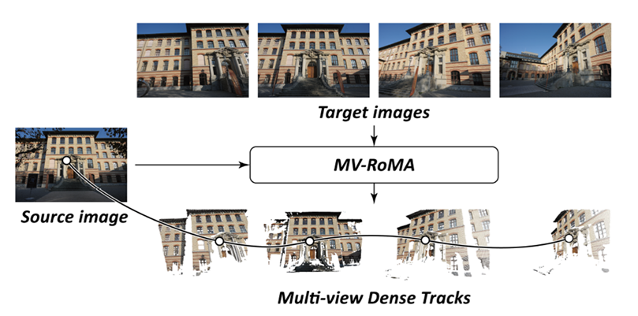

<div align="center">

<h1> [⭐CVPR2026 Highlight] MV-RoMa: From Pairwise Matching into Multi-View Track Reconstruction</h1>

<h3><a href="https://arxiv.org/abs/2603.27542">Paper</a> | <a href="https://icetea-cv.github.io/mv-roma/">Project Page</a></h3>

<h3><a href="https://icetea-cv.github.io/">Jongmin Lee</a>, Seungyeop Kang, Sungjoo Yoo</h3>

</div>

---


## Overview



<div align="center">

**MV-RoMa is a dense correspondence model that simultaneously matches a source image to multiple target images, producing consistent multi-view correspondences and high-quality tracks for 3D reconstruction.**

</div>


## Installation

**Step 1: Install PyTorch (CUDA 11.8)**

Requires **Python >= 3.10**.

```bash
pip install torch==2.5.1+cu118 torchvision==0.20.1+cu118 torchaudio==2.5.1+cu118 \
    --index-url https://download.pytorch.org/whl/cu118
```

**Step 2: Install UFM (UniFlowMatch)**

```bash
git clone --recursive https://github.com/UniFlowMatch/UFM.git
cd UFM/UniCeption && git checkout f839559 && pip install -e . && cd ..
pip install -e .
```

**Step 3: Install remaining dependencies**

```bash
pip install -r requirements.txt
```

## Demo

```bash
python demo.py \
    --weight_path /path/to/model.pth \
    --src img1.jpg \
    --tgts img2.jpg img3.jpg img4.jpg
```

**Example with visualization:**

```bash
python demo.py \
    --weight_path ./outdoor_final.pth \
    --src assets/DSC_0341.jpg \
    --tgts assets/DSC_0338.jpg assets/DSC_0345.jpg assets/DSC_0352.jpg \
    --viz
```

The output `corresps` is a dict keyed by scale. Each entry contains:
- `flow`: `(B, T, 2, H, W)` — dense correspondence map from source to each target; values are normalized to `[-1, 1]`
- `certainty`: `(B, T, 1, H, W)` — per-pixel confidence (pre-sigmoid logits; apply `.sigmoid()` to get values in `[0, 1]`)

For higher resolution output (requires more GPU memory):

```python
corresps = run_model_test(
    model, image_dict,
    coarse_res_hw=(672, 672),
    target_res_hw=(1344, 1344),
    prematch_model=prematch_model,
    prematch_model_name=prematch_model_name,
    upsample_preds=True,
    num_cluster=512,
    device=device,
)
```

## Evaluation

**HPatches homography estimation:**

```bash
python eval_hpatches.py \
    --weight_path /path/to/model.pth \
    --data_root /path/to/hpatches-sequences-release
```

## Model Weights

| Model | Description | Download |
|---|---|---|
| `outdoor_final.pth` | Outdoor scenes (MegaDepth) | [Google Drive](https://drive.google.com/file/d/19lrmYdZLD8nsiSLr-c5KFqENqCAv4W1D/view?usp=sharing) |
| `indoor_final.pth` | Indoor scenes (MegaDepth+ScanNet) | [Google Drive](https://drive.google.com/file/d/1L1GrTDy9N5u4CXR09fWOoAdCaQzgkeLV/view?usp=sharing) |

## Citation

```bibtex
@InProceedings{Lee_2026_CVPR,
    author    = {Lee, Jongmin and Kang, Seungyeop and Yoo, Sungjoo},
    title     = {MV-RoMa: From Pairwise Matching into Multi-View Track Reconstruction},
    booktitle = {Proceedings of the IEEE/CVF Conference on Computer Vision and Pattern Recognition (CVPR)},
    month     = {June},
    year      = {2026},
    pages     = {7446-7456}
}
```

## Acknowledgements

MV-RoMa builds on [RoMa](https://github.com/Parskatt/RoMa), [UFM](https://github.com/UniFlowMatch/UFM), and [Tracktention](https://zlai0.github.io/TrackTention/). We thank the authors for their great work.

The HPatches evaluation code is heavily inspired by [RoMa](https://github.com/Parskatt/RoMa) and [CoMatcher](https://github.com/EATMustard/CoMatcher). 
